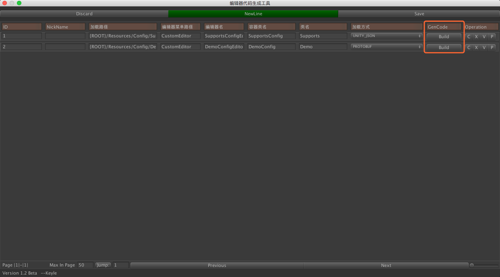

# UNITY3D-DATA-VIEWER
UNITY3D 可视化数据编辑器 / UNITY3D EDITOR DATA_VIEWER .
<br/>

UNITY3D-DATA-VIEWER项目是客户端配置文件解决方案。它的初衷是加速工作流程，<code>程序写好类策划就能配，运行就能跑!</code>


# 特性
* 节约程序大量编辑器开发时间。
* 在定义完成基础类型的时候，即可同步生成可视化编辑器。
* 所见即所得不需要重复从excel导数据到Unity。
* 自动化流程不易出错，如外联Check，基础类型检查等。
* 强扩展性，自定义行数据逻辑检查，扩展按钮，扩展编辑器事件等。
* 无缝支持Unity内建类型，vector2/vector3/vector4/color/bounds/curves 与数据基础类型等。
* 多种存储格式选择
* ...


```
└── SmartDataViewer
    ├── Assets
    │   ├── 3rdPlugins
    │   │   ├── SmartDataViewer  编辑器源代码目录
    │   │   │   ├── CTS                模版
    │   │   │   ├── Config             内建配置
    │   │   │   ├── Editor             内建编辑器目录
    │   │   │   │   ├── BuildInEditor  
    │   │   │   │   └── ModelDesign
    │   │   │   ├── EditorResources    内建编辑器资源目录
    │   │   │   └── Script             用户需要使用到的代码
    │   │   │       ├── Container
    │   │   │       └── Helpers
    │   │   └── proto-net              使用protobuf需要用到到此库
    │   │       ├── Compiler
    │   │       ├── Meta
    │   │       ├── Properties
    │   │       ├── Serializers
    │   │       ├── ServiceModel
    │   │       ├── Web
    │   │       └── obj
    │   │           ├── Debug
    │   │           └── Profile
    │   ├── DemoEntity                 测试用的实体类
    │   ├── Editor                     代码生成器导出目录
    │   │   └── Export                 导出的编辑器代码会在这儿
    │   └── Resources                  资源目录(可在生成器中修改)   
    │       └── Config

```


# Current Version 1.3.2 BETA

初次尝试请直接在UNITY菜单中选择 <code>SmartDataViewer/Code Generator -> GenCode列中的 Build按钮 </code> 即可在工程中创建编辑器导出路径 <code>Editor/Export/</code> 。其中有已经成功生成的编辑器脚本。


您在Unity最上的菜单栏 <code>CustomEditor</code> 中看到对应的编辑器。


## Video on YouTube

视频暂时不录


# 正确的打开姿势 / Tutorial
## 准备工作
1. 在本项目中您只需要关注位于 <code>DemoEntity</code> 中的测试代码。
2. 您如果选择不使用Protobuf则可以直接删除 <code>3rdPlugins</code> 文件夹中的 <code>proto-net</code> 内容。
3. 在您决定移除protobuf的时候可以直接移除其相关的代码。


## 1.创建容器 / Create Container
在下面这个例子中由于使用了protobuf序列化，在 DemoConfig 中您可以看到 <code>ProtoMember ProtoContract ProtoInclude</code>标签。
我们主要关注如下标签 <code>ConfigEditor 与 ConfigEditorField</code> 

```
ConfigEditor       属性配置您可以在 SmartDataViewer/Editor Setting 中的 Custom 配置。
ConfigEditorField  属性配置您可以在 SmartDataViewer/Control Setting 中的 Custom 配置。
```


Type 1
``` cs
[ProtoContract]  
[Serializable][ConfigEditor(2)]
public class DemoConfig : ConfigBase<Demo> { }

[ProtoContract]  
[Serializable]
public class Demo 
{
	public Demo()
	{
		strList = new List<string>();
		list = new List<int>();
		supports = new List<int>();
		description = string.Empty;
	}

	[ProtoMember(3)]
	public List<string> strList;

	[ProtoMember(4)]
	public List<int> list;

	[ProtoMember(5)]
	[ConfigEditorField(19)]
	public List<int> supports;

	[ProtoMember(6)]
	public string description;

	[ProtoMember(7)]
	[ConfigEditorField(19)]
	public int support;
}
```


Type 2
``` cs

[Serializable][ConfigEditor(1)]
public class SupportsConfig : ConfigBase<Supports> { }

[Serializable]
public class Supports
{
	public Supports()
	{
		testFloat = 0;
		boolList = new List<bool>();
		description = string.Empty;
		colorList = new List<Color>();
		curveList = new List<AnimationCurve>();
		curve = new AnimationCurve();
		bounds = new Bounds();
		boundsList = new List<Bounds>();
		descriptionList = new List<string>();
		testPointlist = new List<Vector2>();
		testPointlist3 = new List<Vector3>();
		testPointlist4 = new List<Vector4>();
		floatList = new List<float>();
	}
	
	[ConfigEditorField(1)]
	public string description;
	
    [ConfigEditorField(2)]
	public Vector2 testPoint;
	
	[ConfigEditorField(3)]
	public Vector3 testPoint3;
	
	[ConfigEditorField(4)]
	public Vector4 testPoint4;

	[ConfigEditorField(5)]
	public List<bool> boolList;

	[ConfigEditorField(6)]
	public int testID;

	[ConfigEditorField(7)]
	public float testFloat;
	
	[ConfigEditorField(8)]
	public Bounds bounds;

	[ConfigEditorField(9)]
	public Color PointColor;

	[ConfigEditorField(10)]
	public AnimationCurve curve;
	
	[ConfigEditorField(11)]
	public List<string> descriptionList;
	
	[ConfigEditorField(12)]
	public List<Vector2> testPointlist;
	
	[ConfigEditorField(13)]
	public List<Vector3> testPointlist3;
	
	[ConfigEditorField(14)]
	public List<Vector4> testPointlist4;
	
	[ConfigEditorField(15)]
	public List<Color> colorList;

	[ConfigEditorField(16)]
	public List<AnimationCurve> curveList;

	[ConfigEditorField(17)]
	public List<Bounds> boundsList;

	[ConfigEditorField(18)]
	public List<float> floatList;
}

```


## 3.生成代码 / Click Build Button
点击build按钮 则会在指定路径生成数据编辑器



## 完成 / Complete


# 如何加载数据？ ／ How to Load Data ?

``` cs
//读取
ConfigContainerFactory.GetInstance().LoadConfig<{实体类型}>({读取路径});

//删除
ConfigContainerFactory.GetInstance().DeleteFromDisk({删除路径})

//保存
ConfigContainerFactory.GetInstance({存储格式}).SaveToDisk({输出路径}, {序列化的实例})

//查询
var subType = c.SearchByID({ID});
var subType2 = c.SearchByNickName({NickName});
```

## 更多 / More
如果您想了解更多关于如何同时实现Protobuf与Json序列化细节，可以观察如下代码。在这里我们使用了工厂来同时支持两中以及未来更多的序列化方式。
在 ```处理不同的配置加载逻辑``` 这行代码注释这里你同样可以参考上面的实现进行自定义的序列化方式定制。

``` cs
public class ConfigContainerFactory : IConfigContainer
{
    /// <summary>
    /// 缓存加载
    /// </summary>
    private Dictionary<DataContainerType, IConfigContainer> loader { get; set; }
    private DataContainerType DefaultContainer { get; set; }

    private ConfigContainerFactory()
    {
        loader = new Dictionary<DataContainerType, IConfigContainer>();
    }

    private static ConfigContainerFactory instance { get; set; }

    public static ConfigContainerFactory GetInstance(DataContainerType containerType = DataContainerType.UNITY_JSON)
    {
        return (instance ?? (instance = new ConfigContainerFactory())).SetLoader(containerType);
    }


    public ConfigContainerFactory SetLoader(DataContainerType containerType)
    {
        if (loader.ContainsKey(containerType))
        {
            DefaultContainer = containerType;
            return this;
        }

        //---- 处理不同的配置加载逻辑 ----
        if (containerType == DataContainerType.UNITY_JSON) loader.Add(containerType,new UnityJsonContainer());
        if (containerType == DataContainerType.PROTOBUF) loader.Add(containerType,new ProtobufContainer());
        
        
        

        //---- 处理不同的配置加载逻辑 ----
        return this;
    }


    /// <summary>
    /// 建议使用 LoadConfig(Type t, string path) 函数
    /// </summary>
    /// <param name="path"></param>
    /// <typeparam name="V"></typeparam>
    /// <returns></returns>
    public V LoadConfig<V>(string path) 
    {
        return (V)loader[DefaultContainer].LoadConfig(typeof(V),path);
    }

    public object LoadConfig(Type t, string path)
    {
        return loader[DefaultContainer].LoadConfig(t,path);
    }
    
    public  bool DeleteFromDisk(string path)
    {
        return loader[DefaultContainer].DeleteFromDisk(path);
    }

    public  bool SaveToDisk(string path,object target)
    {
        return loader[DefaultContainer].SaveToDisk(path,target);
    }
}
```

# Next Version 

下个版本核心：
1. 增加 Model Design 面板用来给策划设计实体类并且支持实体类代码生成，实现流程自动化。
2. 补全更多的数据序列化格式。

敬请期待。

